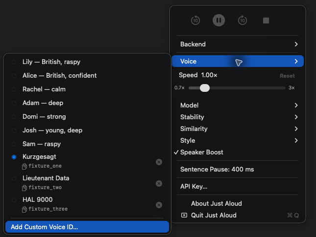
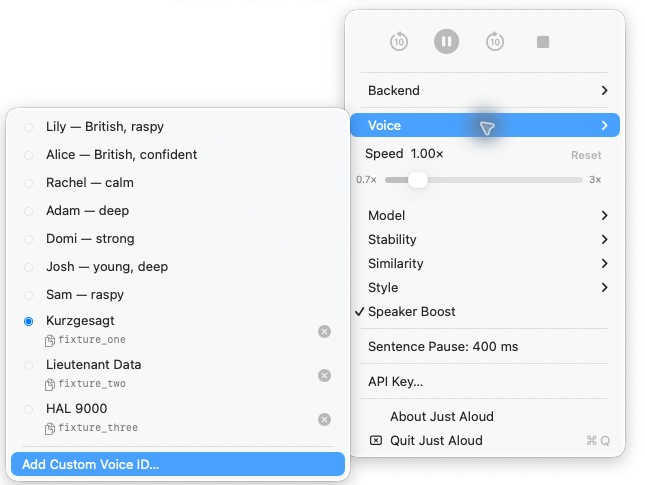
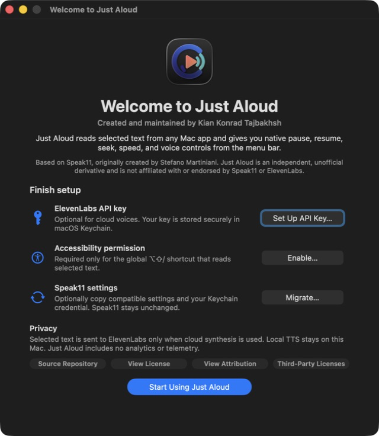
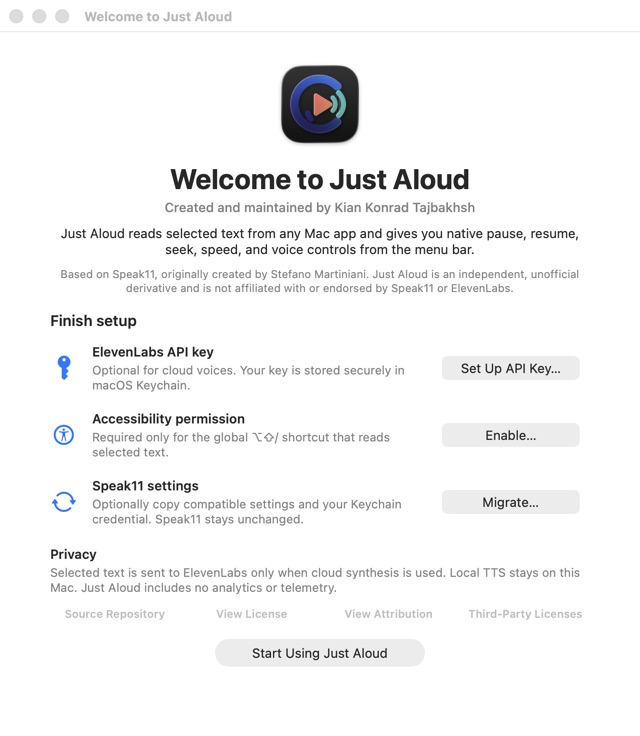

# Just Aloud

Just Aloud is a native macOS menu-bar app that reads selected text with
ElevenLabs or optional local Kokoro TTS, with familiar playback controls and a
private multi-voice library.

> **Independent and unofficial.** Just Aloud is based on
> [Speak11](https://github.com/smcantab/speak11), originally created by Stefano
> Martiniani. It is maintained by Kian Konrad Tajbakhsh and is not affiliated
> with or endorsed by Speak11 or ElevenLabs.

| Dark appearance | Light appearance |
|---|---|
|  |  |

| Welcome in dark appearance | Welcome in light appearance |
|---|---|
|  |  |

## Features

- Pause and resume without losing position
- Skip backward or forward 10 seconds and stop playback
- Pitch-preserving playback speed from 0.7× to 3×
- Menu-bar animation only while audio is actually audible
- Paste, save, name, select, copy, and remove multiple custom voice IDs
- Unified preset/custom voice selector that stays open while comparing voices
- ElevenLabs cloud synthesis or optional local Kokoro synthesis on Apple Silicon
- Original adaptive macOS icon and separate monochrome menu-bar template
- Safe opt-in migration from Speak11 without removing the original installation
- Native first-launch welcome and setup screen, reopenable from About

## Requirements

- macOS 13 Ventura or later
- Apple Silicon for optional local Kokoro TTS
- An ElevenLabs API key for cloud synthesis
- Accessibility permission for the global `⌥⇧/` shortcut

## Install

### Direct download

Download the ZIP from the
[latest release](https://github.com/Kian-hdr/just-aloud/releases/latest), open
it, and move **Just Aloud.app** to Applications. Releases are signed with Kian
Konrad Tajbakhsh's Developer ID certificate and notarized by Apple.

For a local source build:

```bash
./scripts/build.sh
open "build/Just Aloud.app"
```

For the interactive source installer, double-click `install.command` or run:

```bash
./install.command
```

### Homebrew installation

```bash
brew tap Kian-hdr/tap
brew install --cask just-aloud
```

Homebrew installs the same signed and notarized application published on the
GitHub release.

## ElevenLabs setup

1. Create an API key in your ElevenLabs account with Text-to-Speech and User
   Read access.
2. Open the Just Aloud menu and choose **API Key…**. The key is stored in macOS
   Keychain, not in the config file.
3. Choose **Voice → Add Custom Voice ID…** and paste a voice ID.
4. Just Aloud fetches the voice name and stores the name and ID locally.

## Accessibility setup

On first launch, choose **Enable…** in Welcome & Setup and allow Just Aloud in
**System Settings → Privacy & Security → Accessibility**. This permission is
used only to read selected text when you press the global `⌥⇧/` shortcut. You
can reopen the guidance from **About Just Aloud → Welcome & Setup…**.

The upstream preset voice IDs are part of Speak11's public stable source. Custom
voice IDs are personal data and are never included in this repository.

## Playback

Select text in any app and press `⌥⇧/`. The media row provides Back 10 seconds,
Pause/Resume, Forward 10 seconds, and Stop. The waveform animates only during
audible playback. It remains static during network/model generation,
inter-sentence pauses, pause, stop, and idle states.

## Privacy

- With ElevenLabs active, selected text and the selected voice ID are sent to
  ElevenLabs to synthesize audio.
- With local Kokoro active, synthesis runs on the Mac after the user downloads
  the model and Python dependencies.
- API keys are stored as generic passwords in macOS Keychain.
- Preferences and voice IDs are stored in `~/.config/just-aloud/config`.
- Runtime data and optional local-TTS files use `~/.local/share/just-aloud/`.
- Just Aloud does not include analytics or telemetry.

Review ElevenLabs' terms and privacy documentation before using its cloud
service with sensitive text.

## Independent installation and migration

| Item | Just Aloud namespace |
|---|---|
| App | `~/Applications/Just Aloud.app` |
| Bundle ID | `space.exlumina.justaloud` |
| Executable | `JustAloud` |
| Command | `~/.local/bin/just-aloud` |
| Config | `~/.config/just-aloud/config` |
| Runtime data | `~/.local/share/just-aloud/` |
| Quick Action | `~/Library/Services/Speak Selection with Just Aloud.workflow` |
| Keychain service | `just-aloud-api-key` |

Just Aloud never silently uninstalls or overwrites Speak11. Choose
**About Just Aloud → Migrate from Speak11…** to copy compatible settings and a
Keychain credential. The original config, app, and Keychain item remain
unchanged, and the API key is copied through the Security framework without
being displayed.

## Uninstall

Double-click `uninstall.command`. It removes only Just Aloud's app, scripts,
Quick Action, config, runtime data, Keychain item, login item, and Accessibility
entry. Speak11 installations and data are not targeted.

## Development

```bash
./scripts/verify.sh
./scripts/build.sh
```

The full suite validates Swift, Bash, and Python code; playback control and
state behavior; namespace isolation; migration fixtures; licensing; secret and
personal-data scans; and repository cleanliness. Release tooling signs nested
Mach-O files before the app and uses hardened runtime without `codesign --deep`
as a signing shortcut.

## Icon sources

[`Design/Icon/JustAloud.icon`](Design/Icon/JustAloud.icon) is the editable Apple
Icon Composer document. Layered SVGs, Default/Dark/Mono sources, Clear and
Tinted previews, the asset catalog, and the `.icns` fallback are included. The
system supplies app-icon masks, shadows, highlights, and materials.
Release builds compile the Icon Composer document with Xcode 26 so Finder,
Launchpad, and About can select the Aqua, Dark Aqua, or tintable rendition.

## Attribution and licenses

- [`LICENSE`](LICENSE): upstream Unlicense text, unchanged
- [`ATTRIBUTION.md`](ATTRIBUTION.md): Speak11 and creator attribution
- [`LICENSING.md`](LICENSING.md): code and brand licensing split
- [`BRAND.md`](BRAND.md): Just Aloud brand asset terms
- [`THIRD_PARTY_NOTICES.md`](THIRD_PARTY_NOTICES.md): dependency audit
- [`CHANGES.md`](CHANGES.md): downstream changes from Speak11 `v1.1.0`

The Just Aloud name, icon, menu-bar artwork, and original brand artwork are
© 2026 Kian Konrad Tajbakhsh, all rights reserved. Source code remains under The
Unlicense; dependencies remain under their respective licenses.

OpenAI Codex assisted with parts of the downstream implementation, testing,
documentation, and release workflow. It is not presented as a legal author,
copyright owner, or conventional human contributor.
